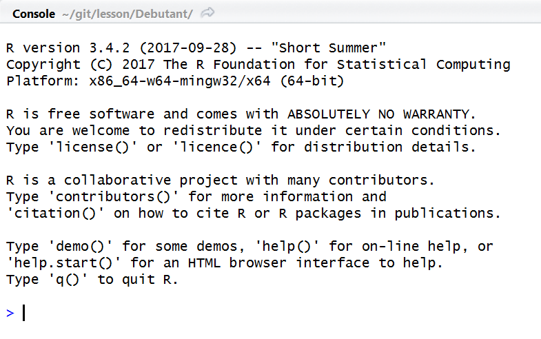

----
  
## Premiers pas

**Ouverture d'une session**

{width="600px"}


* R attend une instruction, ceci est indiqué par __>__ en début de
ligne. 
* Cette instruction doit être validée par _Entrée_ pour être _éxécutée_.
* instruction correcte : R éxécute et redonne la main avec __>__
* instruction incorrecte :  R retourne __+__, il faut alors compléter l'instruction ou sortir avec _Echap_

----
  
### Répertoire courant et chemins

Endroit par défaut où _R_ écrira/accèdera à des scripts et des fichiers

* __getwd()__ : retourne le répertoire courant
* __setwd(path)__ : change le répertoire courant
* avec __RStudio__ : Session/Set working directory

```{r, eval = TRUE}
getwd()
setwd("C:\\Users") # notation typée windows, on double les baskslash
setwd("C:/Users") # notation typée linux, un slash
getwd()
````

```{r, eval = TRUE, echo = FALSE}
setwd("C:/Users/Datastorm/Documents/git/lesson/Debutant/Cours")
````

----
  
### Les packages

* Installation via l'onglet __Packages__ dans RStudio, ou avec la commande :

```{r, eval = FALSE}
install.packages("ibr")
````

* Chargement avec __library()__ ou __require()__ :

```{r, eval = FALSE}
library(ibr)
require(ibr)
````

### Trouver de l'aide

* __?__ ou __help()__, avec le nom d'un package / d'une fonction
* ou avec l'onglet __Help__ dans RStudio

```{r, eval = FALSE}
?mean
help(stats)
````

----
  
## Les objets

Les principaux types de données sont :

* __vide__ (null) : NULL
* __booléen__ (logical) : TRUE, FALSE
* __entier__ (integer) : 1, 2, 10
* __numérique__ (numeric) : 1, 10.5, 1e-10
* __complexe__ (complex) : 2+0i
* __caractères__ (character) : 'bonjour', "hello"
* __facteurs__ (factor) : type dérivé de __caractères__

Deux grandes familles de structure de données :

* avec des éléments de même type (__vecteur__(vector), __matrice__(matrix))
* avec des éléments de différents types (__liste__(list), __data.frame__(data.frame))

----
 
* Création d'un objet par affectation, avec __=__ ou __<-__
* __objects()__ liste les objets en mémoire 


```{r, eval = TRUE}
objects()
x <- 2
objects()

X = 4
objects() # les objets en mémoire

x;X # on peut enchaîner les instructions avec un ;
````

----
 
* __rm()__ supprime un ou plusieurs objet 
* __exists()__ teste l'existance d'un objet

```{r, eval = TRUE}
x <- 1 ;  y <- 2 ; z <- 3
objects()
rm(x, z)
objects()
exists("y")
exists("z")
````

----

### Vecteur (Logique, Numérique, caractère, ...)

* création avec la fonction __c()__

```{r, eval = TRUE}
x <- c(1, 2, 3, 4) ; x
````

* ajout d'éléments avec la concaténation

```{r, eval = TRUE}
c(x, 5)
````

* __rep()__ : répétitions

```{r, eval = TRUE}
rep(c("A", "B"), times = 2)
rep(c("A", "B"), each = 2)
````

----

* __seq()__ : création de séquences

```{r, eval = TRUE}
seq(1, 10, by = 2)
seq(1, 10, length = 4)
1:5 # (=) seq(1, 5, by = 1)
````


* vecteur nommé

```{r, eval = TRUE}
y <- c(a = 1, b = 2)
y
````

----

* fonctions utiles
```{r, eval = TRUE}
is.vector(y)
class(y);mode(y)
length(y)
names(y)
names(x)
````


----

### Matrices (Logique, Numérique, caractère, ...)

* création avec la fonction __matrix()__

```{r, eval = TRUE}
matrix(1:3)
matrix(1:6, nrow = 2, ncol = 3)
matrix(1:6, nrow = 2, ncol = 3, byrow = TRUE)

````

----

* concaténer des matrices :
    + __rbind__ pour les lignes
    + __cbind__ pour les colonnes

```{r, eval = TRUE}
x <- matrix(1:6, nrow = 3, ncol = 2)
y <- matrix(5:6, nrow = 1)
rbind(x, y)

z <- matrix(5:7)
cbind(x, z)
````

**les nombres et les noms de lignes/colonnes doivent correspondre**

----

* matrice nommée

```{r, eval = TRUE}
mat <- matrix(1:4, nrow = 2, ncol = 2, dimnames = list(c("r1", "r2"), c("c1", "c2")))
mat
mat2 <- matrix(1:4, nrow = 2, ncol = 2)
identical(mat, mat2)

colnames(mat2) <- c("c1", "c2")
rownames(mat2) <- c("r1", "r2")
identical(mat, mat2)
````

----

* fonctions utiles
```{r, eval = TRUE}
is.matrix(mat)
class(mat)
mode(mat)
dim(mat) #nrow(mat); ncol(mat)
colnames(mat);rownames(mat) #dimnames(mat)
````


----

### Listes

* création avec la fonction __list()__

```{r, eval = TRUE}
list(1:5, LETTERS[1:2])
````

* liste nommée
```{r, eval = TRUE}
l <- list(nombres = 1:5, caracteres =LETTERS[1:2])
l
````

----

* concaténation 
```{r, eval = TRUE}
l$boolean <- TRUE
l[[2]] <- "remplacement de l'element 2"
l[[5]] <- "nouvel d'un element en 5ième position"
l
````

----

* fonctions utiles
```{r, eval = TRUE}
is.list(l)
class(l)
sapply(l, class)
length(l)
names(l)
````


----

### data.frame

Le **data.frame** est une **liste de vecteurs**

* création avec la fonction __data.frame()__

```{r, eval = TRUE}
data.frame(nombres = 1:3, lettres = LETTERS[1:3])
````

* ajout de rownames
```{r, eval = TRUE}
data.frame(nombres = 1:3, lettres = LETTERS[1:3], row.names = paste0("r", 1:3))
````

----

* concaténer des data.frames :
    + __rbind__ pour les lignes
    + __cbind__ pour les colonnes
    
```{r, eval = TRUE}
x <- data.frame(nombres = 1:2, lettres = LETTERS[1:2])
y <- data.frame(nombres = 3, lettres = "C")
rbind(x, y)

z <- c(TRUE, FALSE)
cbind(x, z) # (=) x$z <- c(TRUE, FALSE), list !
````

**les nombres et les noms de lignes/colonnes doivent correspondre**

----

* fonctions utiles
```{r, eval = TRUE}
is.data.frame(x)
is.list(x) # un data.frame est en fait une liste...!
class(x)
sapply(x, class)
dim(x) #nrow(x); ncol(x)
````
----

```{r, eval = TRUE}
colnames(x)
rownames(x)
head(x)
tail(x, n = 1)
````

----

### Les facteurs

* fonction __as.factor()__

```{r, eval = TRUE}
f <- c("A", "B", "A")
f <- as.factor(f)
f
levels(f) # les niveaux des facteurs
nlevels(f) # le nombre de niveaux
relevel(f, ref = "B") # changer le niveau de référence
````

----

* Découpage en classes avec la fonction __cut()__
```{r, eval = TRUE}
x <- 1:10
f <- cut(x, breaks=c(1,2,4,10),include.lowest=TRUE)
f
````

* Fusion / renommage de niveaux avec __levels()__
```{r, eval = TRUE}
levels(f)
levels(f) <- c("[1,4]", "[1,4]", "(4,10]")
f
````

----
  
## Sélection dans les objets

* par la position, dans ce cas il faut indiquer un vecteur de position (il peut être longueur différente de l'objet)
* par des noms, si il y en a...!, avec le même principe que pour les positions
* par des booléans, dans ce cas le **vecteur de booléen doit être de la longeur de l'objet à sélectionner**. On ne conserve que les ``TRUE``
    
*Les opérateurs logiques, renvoyant des booléans :*

* __==__, __!=__, __>__, __<__, __>=__, __<=__
* __%in%__ appartenance à un ensemble de caractères
* __&__ pour satisfaire plusieurs conditions
* __|__ pour satisfaire au-moins une condition
* __!__ la négation de booléans


----
  
### Exemples sur des vecteurs

**Par la sélection avec des positions :**

```{r, eval = TRUE}
x <- c(1:10)
x[5]
x[c(1, 10, 1)]
````

**Par la suppression :**

```{r, eval = TRUE}
x[-c(1:8)]
````

----
  
**Par des logiques :**
```{r, eval = TRUE}
x < 3
x[x < 3]
````

**Avec des noms :**
```{r, eval = TRUE}
x <- c(a = 1, b = 2, c = 3)
x["a"] ; x[["a"]] ; x[c("a", "b", "a")]
````

----
  
### Exemples sur les matrices

```{r, eval = TRUE}
mat <- matrix(1:9, nrow = 3, ncol = 3, 
              dimnames = list(c("r1", "r2", "r3"), c("c1", "c2", "c3")))
````

**Par les positions :**
```{r, eval = TRUE}
mat[1:2, c(1, 3)]
mat[-c(2),]
````


**Par des logiques :**
```{r, eval = TRUE}
mat[mat[, 1] == 1,]
````

----
  
**Avec les noms :**
```{r, eval = TRUE}
mat["r1","c1"]
````

Attention quand on sélectionne une seule colonne, R renvoie un vecteur plutôt qu'une matrice. On contrôle cela avec l'option __drop = FALSE__

__C'est une des sources d'erreurs de code la plus fréquente !__

```{r, eval = TRUE}
mat[, 1]
mat[, 1, drop = FALSE]
````

----
  
### Exemples sur les data.frame

```{r, eval = TRUE}
dat <- data.frame(nombres = 1:3, lettres = LETTERS[1:3], row.names = paste0("r", 1:3))

dat[1:2, 1, drop = FALSE]
dat[-c(2),]
dat[dat$lettres %in% c("A", "C") == 1,]
dat["r1","lettres"]
````


----
  
### Exemples sur les listes

```{r, eval = TRUE}
l <- list(nombres = 1:5, caracteres =LETTERS[1:2])
l[[1]] # on récupère l'élément de la liste
l$caracteres
l[1] # on récupère une liste
l[c(1, 1)]
````


----
  
## Afficher des informations sur la structure d'objet

en utilisant la fonction __str()__

```{r, eval = TRUE}
## vecteur
x <- 1:10
str(x)
## data.frame (même affichage pour les matrices)
dat <- data.frame(nombres = 1:3, lettres = LETTERS[1:3])
str(dat)
## liste
l <- list(nombres = 1:5, caracteres =LETTERS[1:2])
str(l)
````


----
  
## Résumer l'information

la plupart des objets R possèdent une méthode __summary__ résumant l'information

```{r, eval = TRUE}
## vecteur
x <- 1:10
summary(x)
## data.frame (même affichage pour les matrices)
dat <- data.frame(nombres = 1:3, lettres = LETTERS[1:3])
summary(dat)
````

----
  
## Ordonner les données

* la fonction __sort()__ permet de trier un vecteur
* la fonction __order()__ retourne les indices des données trièes

```{r, eval = TRUE}
x <- round(rnorm(10), digits = 2)
sort(x)
order(x)
sort(x, decreasing = TRUE)
order(x, decreasing = TRUE)
````


----
  
## Compter les occurences

* la fonction __table()__ permet de compter les occurences d'une variables, ou de plusieurs variables croisées

```{r, eval = TRUE}
dat <- data.frame(nb = sample(1:10, 100, replace = T),
                  lt = sample(LETTERS[1:3], 100, replace = T))
head(dat, n = 2)
table(dat$lt)
table(dat$lt, dat$nb)
````

----
  
## Dédupliquer les données

* la fonction __unique()__ renvoie les valeurs uniques d'un objet. Elle peut s'appliquer aux data.frame et matrices
* la fonction __duplicated()__ renvoie les valeurs en doubles

```{r, eval = TRUE}
x <- c(1:5, 2)
x
unique(x)
duplicated(x)
duplicated(x, fromLast = T)
which(duplicated(x, fromLast = T)) # which retourne les indices TRUE
````

----

## Quelques manipulations sur les data.frame

* ajouter une nouvelle variable qui résulte d'un calcul entre d'autres variables : __transform()__

```{r, eval = TRUE}
dat <- data.frame(x = 1:3, y = c(10,20,30))
dat <- transform(dat, z = x+y) # équivalent à dat$z = dat$x + dat$y
head(dat)

````

* faire un subset sur les lignes : __subset()__

```{r, eval = TRUE}
subset(dat, x > 2) # dat[dat$x > 2, ]
subset(dat, x > 1, select = c(y))

````

----

* découper le jeu de données en fonction de critère : __split()__

```{r, eval = TRUE}
dat <- data.frame(x = 1:9, y = LETTERS[1:3])
split(dat, dat$y)
````

**On récupère une liste**

----

* faire des calculs aggrégés : __aggregate()__

```{r, eval = TRUE}
aggregate(dat$x, by = list(dat$y), FUN = max)
aggregate(dat$x, by = list(dat$y), FUN = mean)
````

----

## Fusion de données

* avec la fonction __merge()__
    + contrôle des clés de jointure avec ``by`` (clés identiques) ou ``by.x`` et ``by.y`` (clés différentes)
    + sens de la jointure avec ``all``, ``all.x`` et ``all.y``. 
    
```{r, eval = TRUE}
dat <- data.frame(x = 1:3, y = LETTERS[1:3])
dat2 <- data.frame(x = sample(1:3, 10, replace = T))
merge(dat2, dat, by = "x")
````


----

## Importer/exporter des données

### fichiers .csv / .txt

* __read.table()__, __write.table()__, __read.csv()__, __write.csv()__
* Principaux arguments :
    + _header_ / _col.names_ : nom des colonnes
    + _row.names_  : nom des lignes
    + _sep_ : séparateur de champs
    + _dec_ : décimale
    + _skip_ : sauter des lignes
    
```{r, eval = FALSE}
dat <- data.frame(x = 1:9, y = LETTERS[1:3])
# exportation
write.table(dat,"C/temp/tab3.csv",sep = ";", row.names = FALSE, col.names = TRUE)

#importation
dat <- read.table("C/temp/tab3.csv",sep = ";", header = TRUE)
````

----

### fichiers .xlsx / .xls

* avec le package __xlsx__ ou __XLConnext__ (dépend de **Java**)
* avec le package __openxlsx__
    + ``read.xlsx()``, ``write.xlsx()``
  
### fichiers SAS / SPSS

* avec le package __sas7bdat__ (``read.sas7bdat``) ou __haven__ (``read_sas``)

```{r, eval = FALSE}
require(sas7bdat)
sasdata <- read.sas7bdat("raw_sas.sas7bdat")
````

* avec le package __foreign__ (format xport)

----

### Sauvegarder et restaurer un ensemble d'objets R

* la fonction __save()__ permet d'enregistrer sur le disque un ou plusieurs objets R
* le stockage des objets est compréssé
* on utilise généralement l'extension __.RData__
* on peut recharger les objets avec la fonction __load()__
* __les objets auront le même nom que lors de la sauvegarde__

```{r, eval = FALSE}
x <- 1:10
l <- list(a = 1, b = LETTERS[1:3])
save(x, l, file = "data.RData")
load(file = "data.RData")
````

Cette utilisation peut poser problème si des variables du même nom existent déjà dans l'environnement lors du chargement.

----

### Sauvegarder et restaurer un objet R

* la fonction __saveRDS()__ permet d'enregistrer un objet
* le stockage des objets est compréssé
* on utilise généralement l'extension __.RDS__
* on peut recharger les objets avec la fonction __readRDS()__
* __on affecte l'objet à la variable de son choix__

```{r, eval = FALSE}
x <- 1:10
saveRDS(x, file = "data.RDS")
y <- readRDS(file = "data.RDS")
````


----

## Connexion à des bases de données

Il existe au minimum un package qui permet de se connecter à chaque type de bases de données, par exemple :

* __RMySQL__ : base de données MySQL
* __ROracle__ : base de données Oracle
* __RPostgreSQL__ : base de données PostgreSQL
* __RSQLServer__ : base de données MS SQL Server
* __mongolite__ : base de données NoSQL mongodb
* __RSQLite__ : base de données SQLite
* __RJDBC__ : connexion à différents types de bases de données via du Java
* __RODBC__ : connexion à différents types de bases de données via du ODBC

----

### Syntaxe usuelle de connexion

* ouverture de la connexion avec __dbConnect()__
* requêtage avec __dbGetQuery()__
* fermeture de la connexion avec __dbDisconnect()__

```{r, eval = FALSE}
con <- dbConnect(dbDriver("PostgreSQL"), host = "myserver", port = 123, 
                 dbname = "database", user = "benoit", password = "security")
res <- dbGetQuery(con, "SELECT * FROM mytable")
dbDisconnect(con)
````

Et aussi : 

* __dbListTables()__, __dbExistTable()__, __dbListFields()__
* __dbReadTable()__, __dbWriteTable()__, 
* __dbSendQuery()__ (écriture dans la table), __dbColumnInfo()__, 
* ...

----

## Les principales fonctions de statistiques descriptives

* __mean()__
* __median()__
* __var()__
* __sd()__
* __sum()__
* __max()__
* __min()__
* __range()__
* __quantile()__

----

## Fonctions de distributions

* __?Distribution__ dans R
* syntaxe : 
    + __dxxx()__, densité
    + __pxxx()__, distribution cumulée
    + __qxxx()__, quantile
    + __rxxx()__, génération aléatoire

avec __xxx__ nom de la loi (_norm_, _unif_, _pois_, _gamma_, ...)

```{r, eval = TRUE}
val <- rnorm(100)
mean(val);sd(val)
````