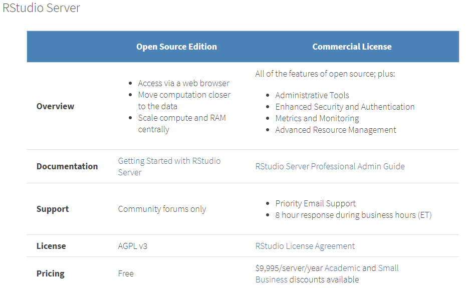

----

## Introduction

**Le logiciel R**

[R](http://cran.r-project.org/) (http://cran.r-project.org/)  est un logiciel de Statistique distribué gratuitement par 
le __CRAN__ créé dans les années 90 dans l'esprit de S :

* dédié à l'analyse statistique et à la visualisation
* environ 80% du temps de l'analyse est dédié à la préparation des données... donc **R** sert aussi à la manipulation des données

**Structure**

* disponible sous de nombreux systèmes d'exploitation
* composé d'un socle et de bibliothèques de fonctions thématiques regroupées sous le nom de __package__
* connectables avec (tous...) les autres langages : *C*, *Fortran*, *Java*, *Python*, *Javacript*, *C++*, ...
* et (toutes...) les bases de données : *MySQL*, *Postgresql*, *Oracle*, *MS sql*, *mongodb*, *Hadoop*, ...
* possible d'appeler **R** depuis *Matlab*, *Excel*, *SAS*, *SPSS*, ....

----

**Les packages**

* R a été pensé comme un langage ouvert et modulaire
* Quasiment tous les chercheurs l'utilisent et donc les nouvelles
méthodes sont souvent implémentées
* Le passage recherche/industrie est de plus en plus rapide. 

**Il est fort probable qu’une autre personne que vous ait déjà rencontré le même problème que le votre (packages existants, de discussions [R-bloggers](http://www.r-bloggers.com/), forum, ....)**

Les dépôts «officiels» :

* Le CRAN (https://cran.r-project.org/) : plus de 6000 packages déposés et maintenus. Recherches thématiques avec les Task Views (https://cran.r-project.org/web/views/) 
* Bioconductor (https://www.bioconductor.org/). Plus de 1200 packages. Populations/analyses fortement liées à la biologie

Les dépôts «personnels» : *GitHub*, *BitBucket*, .... Packages du CRAN et de bioconductor (interactions utilisateurs), ou en cours de développement

----

**Caractéristiques**

**R** est différent des autres logiciels donc n’essayez pas de rechercher des analogies, il a sa propre façon de travailler.
Par exemple, vous n’avez pas besoin de trier (sort) les données pour les résumer, aggréger, splitter, merger... (http://rforsasandspssusers.com, http://www.statmethods.net)

* [R](http://cran.r-project.org/) est un langage __interprété__
    + == il requiert un autre programme, l'interprète, pour l'éxécution de ses commandes
    + != des langages __compilés__, comme le C ou le C++, qui sont d'abord convertis en code machine par le compilateur avant de pouvoir être éxécutés
    
* il est basé sur la notion de vecteur (simplification des calculs, utilisation réduite des boucles)
* **pas de typage ni de déclaration obligatoire des variables**
* **R** est sensible à la casse (minuscules/majuscules)
* **R** travaille **in-memory**
* l’ensemble des données/tables **sont présentes dans la mémoire RAM**


## Editeurs de texte / IDE

* Plus confortable (undo-redo, clavier ou souris etc.)
* Plus rapide : dès que l’on recommence !
* Plus clair : commentaires dans le texte

```{r, eval = FALSE}
#### ma premiere commande
1+1
#### les choses serieuses: importation du fichier
```

* *Tinn-R*, *Notepad++*, *Emacs*, ....
* **Rstudio** s’impose comme le leader actuel.


----

**RStudio**

**RStudio** est un IDE permettant de travailler en **R** dans un environnement de développement riche et complet : 


{width="650px"}

* Editeur de texte, de codes....
* Espace de travail, historique, importation...
* Visualisation, aide, packages
* Console **R**

----

**RStudio**

Version **Desktop** et **server** (environnement linux), gratuite ou pro...

{width="650px"}

* http://www.rstudio.com/products/RStudio
* https://www.rstudio.com/products/rstudio/download/

----

**RStudio**

* **Projet** : *file -> New project*. Ensemble de scripts, de données, ... 
* **Notebook** : *file -> New file -> R Notebook*. Notebook comme pour **python**, document incluant du code **R**, son évaluation, des commentaires, ... (http://rmarkdown.rstudio.com/r_notebooks.html)
* **R Markdown** : *file -> New file -> R Markdown*. Génération de fichiers *.html*, *.pdf*, *.docx*, ... depuis **R** (http://rmarkdown.rstudio.com/index.html)

Quelques premiers raccourcis utiles : 

* **Ctrl + Entrée** : éxécution de la ligne de code courante ou des lignes sélectionnées dans le script
* **Ctrl + Shift + C** : ajout / suppression de commentaires
* **Ctrl + A** : Sélection de tout le script courant
* **Ctrl + I** : Indentation de la sélection

Plus d'informations dans le menu *Tools -> Keyboard shortcuts*

## R optimisé ?

* **R** a été conçu pour utiliser seulement un seul processeur à la fois. Même aujourd'hui, **R** travaille de cette façon par défaut.

* Il est possible de le lié avec les librairies de **BLAS/LAPACK** parallèle.

**Microsoft R Open**

**Microsoft R Open**, version de **R** optimisé, inclut ces librairies mathématiques. Cela permet de réduire significativement les temps de calculs pour les opérations matricielles.

https://mran.microsoft.com/rro

https://mran.microsoft.com/documents/rro/multithread

https://mran.microsoft.com/download