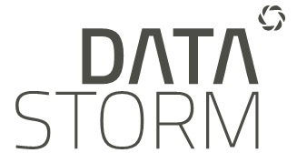

<div style="text-align:center" markdown="1">
<br><br><br><br><br><br>
<h2>R Initiation</h2>
<h3>B.Thieurmel - benoit.thieurmel@datastorm.fr</h3>
<h3>Enedis - 19 & 22/11/2018</h3>





</div>

```{r child = 'R_history.Rmd'}
```
    
    
```{r child = 'Premiers_pas.Rmd'}
```


```{r child = 'strings.Rmd'}
```

## Ressources

* [The R Core Team Intro](https://cran.r-project.org/doc/manuals/r-release/R-intro.pdf) : https://cran.r-project.org/doc/manuals/r-release/R-intro.pdf

* [The R Core Team Langage Definition](https://cran.r-project.org/doc/manuals/r-release/R-lang.pdf) : https://cran.r-project.org/doc/manuals/r-release/R-lang.pdf

* [Introduction à la programmation R](https://cran.r-project.org/doc/contrib/Goulet_introduction_programmation_R.pdf) : https://cran.r-project.org/doc/contrib/Goulet_introduction_programmation_R.pdf

* [Cheatsheets RStudio](https://www.rstudio.com/resources/cheatsheets/) : https://www.rstudio.com/resources/cheatsheets/
