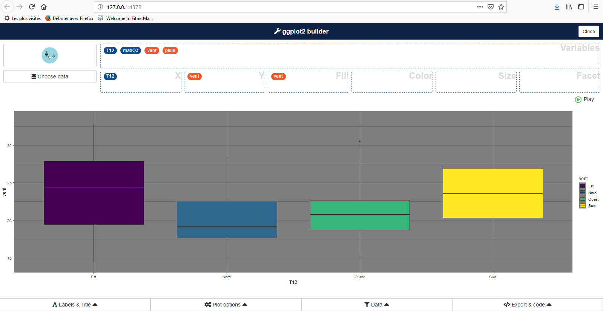

----

## Les graphiques : introduction à la fonction plot

On représente facilement une fonction avec la fonction __plot()__, et deux vecteurs de même taille en entrée :

```{r, eval = TRUE}
grillex <- seq(0, 1,length=50)
fx <- sin(2*pi*grillex)
plot(x = grillex, y = fx) # plot(fx~grillex) notation formule
````

----
  
### Type de graphique : ligne ou points ?

l'argument __type__ contrôle le type du graphique. Les plus courants sont : __p__ _(points)_, __l__ _(ligne)_, __b__ _(ligne + points)_, __s__ _(step)_,...

```{r, eval = TRUE}
plot(x = grillex, y = fx, type = "l")
````
 
----
  
### Les couleurs

En utilisant l'argument __col__ :

```{r, eval = TRUE}
plot(x = grillex, y = fx, type = "s", col = "red")
````

 
----
  
### Type de points

On gère le type des points avec __pch__ (_?points). __cex__ fixe la taille des points :

```{r, eval = TRUE}
plot(x = grillex, y = fx, col = "red", pch = 1:25, cex = c(1:2))
````

 
----
  
### Type de lignes

On gère le type des lignes avec __lty__ (_?par). __lwd__ fixe l'épaisseur :

```{r, eval = TRUE}
plot(x = grillex, y = fx, type = "l", lty = 1, lwd = 2, ylim = c(-2, 1))
for(i in 2:6) lines(x = grillex, y = fx - (i/10), lty = i)
````

 
----
  
### Titre et intitulés des axes

__main__ : titre, __sub__ : sous-titre, __xlab__ : intitulé des abscisses, __ylab__ : intitulé des ordonnées

```{r, eval = TRUE}
plot(x = grillex, y = fx, main = "Titre", sub = "Sous-titre", 
     xlab = "abscisses", ylab = "ordonnées")
````
 
----
  
### Ajout de lignes

__lines()__ : ajout d'une nouvelle ligne

```{r, eval = TRUE}
plot(x = grillex, y = fx, ylim = c(-2, 1))
lines(x = grillex, y = fx - 0.2)
````

 
----
  
__abline()__ : ajout de droites (__h__ horizontales, __v__ verticales, __a__ & __b__ avec coefficients)

```{r, eval = TRUE}
plot(x = grillex, y = fx)
abline(h = 0, lty = 2) ; abline(v = 0, lty = 2)
abline(a = -1, b = 2)
````

 
----
  
### Ajout de points

fonction __points()__

```{r, eval = TRUE}
plot(x = grillex, y = fx, ylim = c(-2, 1))
points(x = grillex, y = fx - 0.2, pch = 5)
points(x = 0.5, y = 0, pch = 15)
````

----
  
### Ajout de texte

En utilisant la fonction __text()__

```{r, eval = TRUE}
plot(x = grillex, y = fx)
text(x = 0.2, y = -1, labels ="ceci est un texte")
````


----
  
### Ajout d'une légende

Simplement avec la fonction __legend()__

```{r, eval = TRUE}
plot(x = grillex, y = fx, type = "l")
legend("bottomleft",legend="sin", col=1, lty=1) 
````

----
  
### Plusieurs graphiques

Utilisation de la fonction __par()__ et de l'argument __mfrow()__. Retour à une fenêtre unique : __dev.off()__

```{r, eval = TRUE}
par(mfrow = c(1, 2))
plot(x = grillex, y = fx, type = "l")
boxplot(fx)
````


----

## Les graphiques de statistique univariés

Les données d'exemples : 

* deux variables quantitatives : 
    + la température _T12_
    + l'ozone _maxO3_
* deux variables qualitatives / facteurs : 
    + le vent
    + la pluie

```{r, eval = TRUE}
ozone <- read.csv("ozone_plot.txt", sep="", stringsAsFactors = TRUE)
summary(ozone)
````

----

### Boxplot

Disponible avec la fonction __boxplot()__

```{r, eval = TRUE}
boxplot(ozone$maxO3, col = "dodgerblue4", xlab = "maxO3")
````

----

### Histogramme

Disponible avec la fonction __hist()__

```{r, eval = TRUE}
hist(ozone[,"maxO3"], main = "Histogramme", xlab = "Ozone", col = "dodgerblue4")
````


----

Ajout de l'estimateur à noyaux, avec la fonction __density()__

```{r, eval = TRUE}
hist(ozone[,"T12"], prob = TRUE, col = "olivedrab3")
lines(density(ozone[,"T12"]))
````


----

### Diagramme en barres

Disponible avec la fonction __barplot()__

```{r, eval = TRUE}
barplot(table(ozone[,"vent"]), col = c("olivedrab3", "dodgerblue4"))
````


----

### Camenbert...

Disponible avec la fonction __pie()__

```{r, eval = TRUE}
pie(table(ozone[,"vent"]), col = c("red", "blue", "darkgreen", "purple")) 
````


----

## Les graphiques de statistique bivariés

### Quantitatif-Quantitatif


```{r, eval = TRUE}
plot(maxO3~T12, data = ozone, col = ozone$vent, pch = 20) 
legend("topleft", legend = levels(ozone$vent), col = 1:4, pch = rep(20, 4))
````

----

### Quantitatif-Qualitatif


```{r, eval = TRUE}
plot(maxO3~vent, data = ozone, 
     col = RColorBrewer::brewer.pal(4,"Accent"))
#  (=) boxplot(maxO3~vent,data=ozone)

````

----

Et dans l'autre sens ? Peut-être un peu dur à lire...!

```{r, eval = TRUE}
plot(vent~maxO3, data = ozone)
````

----

### Qualitatif-Qualitatif

```{r, eval = TRUE}
plot(pluie~vent, data = ozone)
````

----
  
## Pour aller plus loin

### Démo

* demo(image)
* example(contour)
* demo(persp)
* require("lattice"); demo(lattice)
* example(wireframe)
* require("rgl"); demo(rgl)
* example(persp3d)
* demo(plotmath); demo(Hershey)

----
  
### ggplot2

__ggplot2__ a été développé par Hadley Wickham comme une implémentation de _Grammar of Graphics_.
C'est un package relativement complet et puissant. (http://ggplot2.org/, http://docs.ggplot2.org/current/, https://www.rstudio.com/wp-content/uploads/2015/03/ggplot2-cheatsheet.pdf)

```{r, eval = TRUE, echo = FALSE}
suppressWarnings(require(ggplot2, quietly = TRUE))
````

```{r, eval = TRUE}
ggplot(mtcars, aes(wt, mpg)) + geom_point(aes(colour = factor(cyl)))
````

----
  
### ggplot2 : utilisation du addin esquisse

Le package __esquisse__ propose une interface _clique bouton- permettant de réaliser des graphiques __ggplot2__ pour ensuite les exporter et/ou récupérer le code R correspondant.

```{r, eval = FALSE}
esquisse:::esquisser(viewer = "browser")
````


{width="800px"}

----
  
### Graphiques intéractifs

En utilisant des packages faisant le pont entre __R__ et des librairies __javascript__ : 

* __htmlwidgets__ (http://www.htmlwidgets.org/) et tous ses enfants (http://gallery.htmlwidgets.org/) : 
    + __dygraphs__ pour les séries temporelles : http://rstudio.github.io/dygraphs
    + __leaflet__ pour les cartes : http://rstudio.github.io/leaflet/
    + __visNetwork__ (http://datastorm-open.github.io/visNetwork) et __networkD3__ (http://christophergandrud.github.io/networkD3/) pour les réseaux
    + __d3heatmap__ pour des heatmaps : https://github.com/rstudio/d3heatmap
    + __DT__ pour des tableaux intéractifs : http://rstudio.github.io/DT/
    + __threejs__ (https://github.com/bwlewis/rthreejs) et __rglwidget__ (http://cran.at.r-project.org/web/packages/rglwidget/index.html) pour des représentations 3D
    + __plotly__ pour passer du __ggplot2__ en intéractif : https://plot.ly/r/
    + ....
    
----
  
### Graphiques intéractifs

- Visibles dans le __Viewer__ de RStudio
- Facilement intégrables à des documents __Rmarkdown__ et des applications __shiny__
- Exportables en .html 


```{r, eval = FALSE}
suppressWarnings(require(dygraphs, quietly = T))
lungDeaths <- cbind(mdeaths, fdeaths)
g <- dygraph(lungDeaths)
# affichage
g

# exportation
htmlwidgets::saveWidget(g, file = "ex_dygraph.html")
````

```{r, eval = TRUE, echo=FALSE}
suppressWarnings(require(dygraphs, quietly = T))
lungDeaths <- cbind(mdeaths, fdeaths)
dygraph(lungDeaths, width = "100%", height = "250px")
````

----


