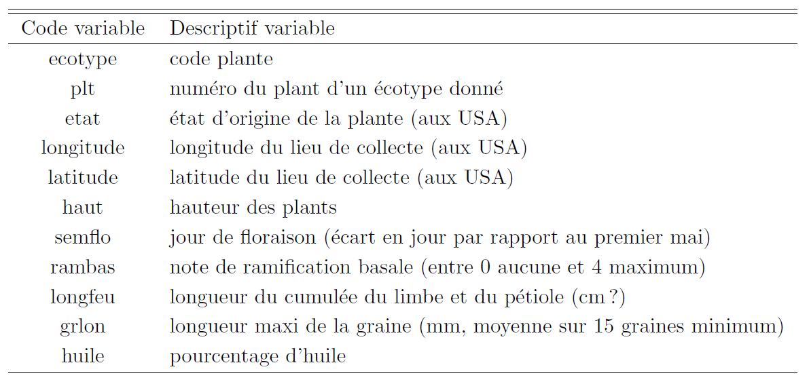

```{r setup, include=FALSE}
knitr::opts_chunk$set(echo = TRUE)
```

# Représenter une variable qualitative

Nous allons rentrer des données à la main pour une variable qualitative. Cette variable représente l'appartenance à un groupe avec 3 modalités **g1**, **g2** et **g3**. Les 2 premiers individus sont dans le groupe 1, les 3 suivants dans le groupe 2 et le dernier dans le groupe 3 :

```{r, eval = FALSE}
ybrut <- c("g1","g1","g2","g2","g2","g3")
print(ybrut)
summary(ybrut)
```

Que fait le dernier ordre ci-dessus ? Nous devons transformer ce vecteur (de caractères) en variable qualitative (nommée ``factor`` sous **R**) :

```{r, eval = FALSE}
y <- factor(ybrut)
```

Que font les ordres suivants ?

```{r, eval = FALSE}
levels(y)
nlevels(y)
table(y)
sum(table(y))
table(y) / sum(table(y)) * 100
```

Tracer les effectifs de chaque modalité dans un diagramme en barre :

```{r, eval = FALSE}
barplot(table(y))
```

Tracer les pourcentages de chaque modalité dans un diagramme en barre :

```{r, eval = FALSE}
barplot(table(y) / sum(table(y)) * 100, ylab = "pourcentages", 
        xlab = "groupes", main = "Répartition de y")
```

Que font les options ``xlab``, ``ylab`` et ``main`` ?

Que fait le résumé numérique d'une variable qualitative ?

```{r, eval = FALSE}
summary(y)
```

# Représenter une variable quantitative continue

Représentons une variable quantitative continue. Ouvrir le fichier **varquant.r** et exécuter son contenu (vous pouvez également utiliser la fonction ``source`` pour inclure ce fichier et l'éxécuter depuis un autre script)

Que fait le résumé numérique d'une variable quantitative (continue) ?

```{r, eval = FALSE}
summary(y)
```

Trouver sur les deux graphiques ci-dessous la différence et expliquer la.

```{r, eval = FALSE}
hist(y, freq = TRUE)
hist(y, freq = FALSE)
```

Que font toutes les options pour ce graphique ?

```{r, eval = FALSE}
hist(y, freq = FALSE, breaks = 10, xlab = "huile", main = "Histogramme")
```

Que fait cette option ?

```{r, eval = FALSE}
hist(y, freq = FALSE, breaks = c(15,18,25,30,36))
```

Expliquer tous les ordres ci-dessous :

```{r, eval = FALSE}
boxplot(y, xlab = "", ylab = "teneur en huile")
mean(y)
abline(h = mean(y))
quantile(y)
median(y)
abline(h = median(y), col = 2)
```

**Conclusion :** l'histogramme est tracé grâce à ``hist`` avec l'option ``freq = FALSE``.

Un autre estimateur de la densité (estimateur à noyau) est disponible afin d'estimer la densité par une fonction continue :

```{r, eval = FALSE}
density(x, ...)
```

Retourne les coordonnées ``x`` et ``y`` d'un estimateur de la densité du vecteur de données ``x``. L'argument ``bw`` indique la largeur de fenêtre (plus elle est grande plus la courbe est lisse)

```{r, eval = FALSE}
lnormal <- rnorm(100)
ndens <- density(lnormal, width=1.2)
hist(lnormal, probability = T)
lines(ndens)
```

# Représenter une variable quantitative discrète

Représentons une variable quantitative discrète : le nombre d'enfant par famille. La première famille ce compose de 5 enfants, la second n'en a pas, la troisième et la quatrième ont 2 enfants et la cinquième n'en a pas.

```{r, eval = FALSE}
y <- c(5,0,2,2,0)
```

Que font les commandes suivantes ?

```{r, eval = FALSE}
unique(y)
sort(unique(y))
table(y)
```

Le diagramme en barre des effectifs est le diagramme suivant : 

```{r, eval = FALSE}
plot(sort(unique(y)), table(y), type="h", ylim = c(0, max(table(y))))
```

En général, dès que les valeurs possibles sont assez nombreuses (par exemple 7 ou 10 ou plus) la variable quantitative
discrète est assimilée à une variable quantitative continue. La distinction quantitatif discret ou continue n'existe pas
sous **R**, les deux sont des variables numériques (``numeric``).

On peut préférer la fonction ``barplot`` : 

```{r, eval = FALSE}
barplot(table(y))
```


# Données des tournesols

1. Importer le tableau **tournesol.csv** dans la variable ``tpropre``. Il  contient les variables décrites ci-dessous. 



2. Donner pour chaque variable son type (variable qualitative, quantitative discrète, quantitative continue).
3. Effectuer un résumé numérique du tableau ``tpropre`` :

```{r, eval = FALSE}
summary(tpropre)
```

4. Quelles sont les variables qui sont reconnues comme variables quantitatives et comme variables qualitatives ?
5. Donner à chaque variable le type voulu grâce à ``factor`` ou ``as.numeric``

# Deux variables quantitatives continues

Par defaut **R** trace des points (``type="p"``) aux coordonnées fournies (ci-dessous l'ordonnée est la variable ``huile`` et l'abscisse la variable ``grlon``). Détailler le rôle des options suivantes : 

```{r, eval = FALSE}
plot(huile~grlon, data = tpropre)
plot(huile~grlon, data = tpropre, pch = "+")
plot(huile~grlon, data = tpropre, col = 2, pch = "+")
```

Traçons des lignes :

```{r, eval = FALSE}
plot(huile~grlon, data = tpropre, type = "l")
```

Qu'a t-on fait ?

```{r, eval = FALSE}
# Trions les donnees préalablement
ordre <- order(tpropre$grlon)
plot(x = tpropre$grlon[ordre], y =  tpropre$huile[ordre], type = "l", 
     lty = 2, lwd = 2, col = "purple")
```

# Deux variables qualitatives : tableau de contingence

Utilisez l'ordre suivant :

```{r, eval = FALSE}
table(tpropre[,"ecotype"], tpropre[,"etat"])
```

Que renvoit il ?

# Données des tournesols (suite)

1. Calculer la moyenne empirique des variables **huile**, **grlon** et **longfeu**.
2. Pour ces mêmes variables donner leurs quartiles empiriques.
3. Pour ces mêmes variables les représenter par un ``boxplot``.
4. Pour ces mêmes variables calculer leur variance empirique.
5. Représenter graphiquement chacune des variables et exporter ces représentations graphiques. (bouton d'export dans **RStudio** ou utilisation des fonction ``jpeg``, ``png``, ``pdf``, ...)