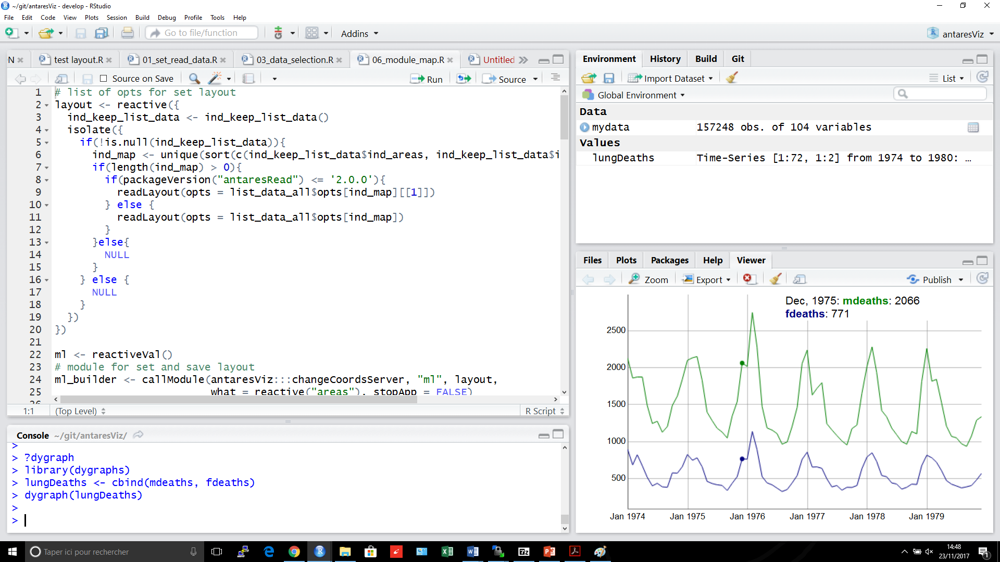

```{r setup, include=FALSE}
knitr::opts_chunk$set(echo = TRUE)
```

{:height="36px" width="700px"}.


\begin{figure}
\centerline{\includegraphics[width=0.5\textwidth]{../Cours/images/rstudio.png}}
\end{figure}