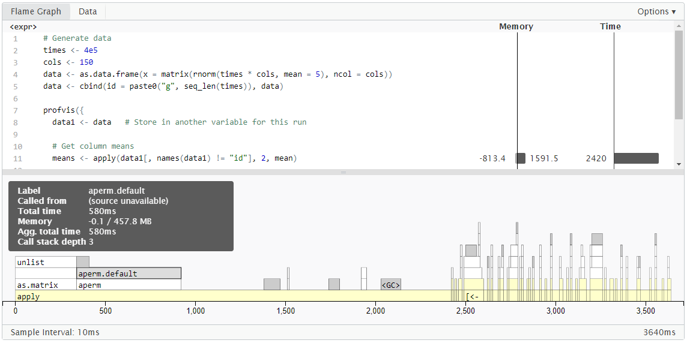
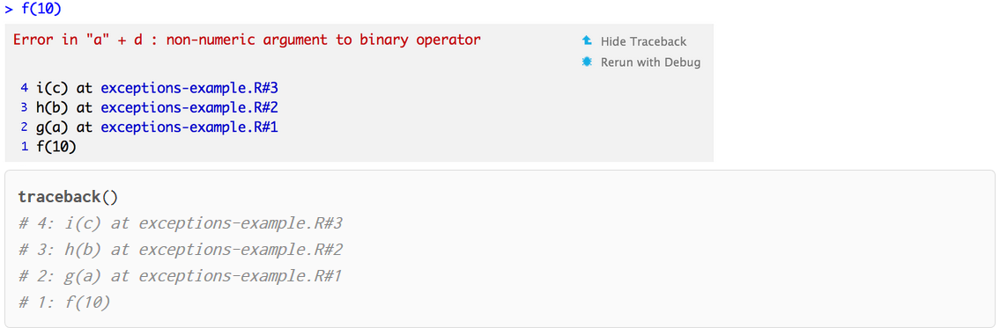

----

## Monitoring / Profiling / Performance / Debug

**Temps de calculs**

Pour monitorer le temps de calculs, la fonction ``system.time()`` peut-être utilisée, mais le package ``microbenchmark`` permet de monitorer avec plus de précision en répétant les appels.

```{r, eval = TRUE}
suppressWarnings(require(microbenchmark, quietly = TRUE))
x <- runif(1000) 
microbenchmark(sqrt(x),x^{1/2},times=1000)
````

-----

**Profilage du code**

Utiliser la fonction ``Rprof`` qui procède par échantillonnage : elle stoppe l’éxécution du code par intervalles (``interval``) et différencie le temps de calcul réalisé par chaque fonction (``self.time``) et le temps global (``total.time``).

```{r, eval = TRUE}
is.prime <- function(n){ 
  n == 2L || all(n %% 2L:ceiling(sqrt(n)) != 0)
} 

all.prime <- function(n){ 
  v <- integer(0) 
  for(i in 2:n){
    if(is.prime(i)){
      v <- c(v,i)
    }
  }  
  v
}
````

```{r, eval = FALSE}
Rprof("Rprof.out", interval = 0.001) 
prime.number <- all.prime(100000) 
Rprof(NULL)
````

-----

**Profilage du code**

```{r, eval = FALSE, echo = TRUE}
summaryRprof("Rprof.out")
````

```{r, eval = TRUE, echo = FALSE}
s <- summaryRprof("Rprof.out")
s$by.self
s$by.total[s$by.total$self.pct > 0, ]
````

-----

**Profilage du code**

D'autres outils existent, avec notamment les packages **proftools** ou **profvis**

https://rstudio.github.io/profvis/

https://cran.r-project.org/web/packages/proftools/vignettes/proftools.pdf

{width="600px"}

-----

**Impact mémoire**

* Dans **R** de base, avec la fonction ``object.size()``. **Problème** : ne prend pas en compte toute la complexité potentielle des objects (environnements rattachés)

* Avec le package **pryr** 
    + ``object_size()``
    + ``mem_used()`` : mémoire utilisée, ``mem_change(code)`` : impact du code sur la mémoire
    
```{r, eval = TRUE, echo = FALSE}
suppressPackageStartupMessages(suppressWarnings(require(pryr, quietly = TRUE, warn.conflicts = FALSE)))
````

```{r, eval = TRUE}
# différence integer / numeric
v_int <- rep(1L, 1e8) ; v_num <- rep(1, 1e8)
object_size(v_int); object_size(v_num)
mem_change(x <- 1:1e6) ; mem_change(rm(x))
````

-----

**Un petit mot sur le déboggage**

* Pour voir simplement les informations : utilisation de _print()_ dans la fonction
* Quand une erreur se produit, information du __traceback__
    + Disponible par défaut dans la console RStudio
    + via la fonction _traceback()_ dans R
* Utilisation de la fonction _browser()_ n'importe où dans le code : elle stoppe l'éxécution et lance un environnement dans lequel on peut accèder aux variables actuelles et continuer l'éxécution
* Insertion de points d'arrêt dans le code
* **RStudio** : menu *Debug*

{width="400px"}


Plus d'informations ici : https://support.rstudio.com/hc/en-us/articles/205612627-Debugging-with-RStudio
