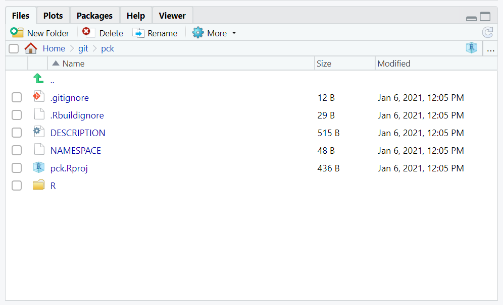
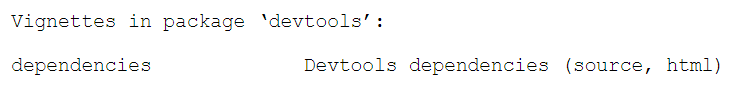
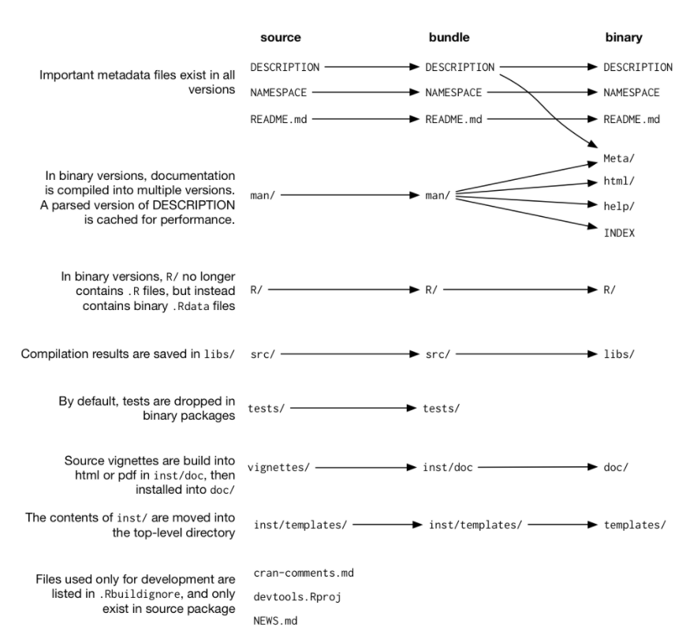
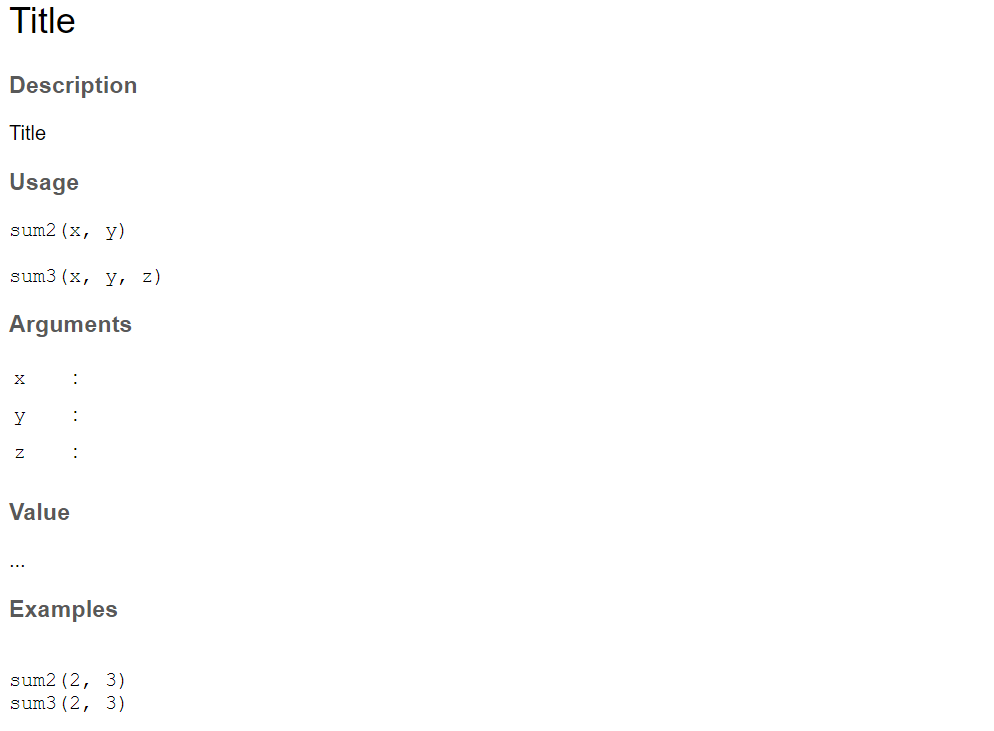

## Pourquoi ?

**Diffusion**

- utilisation du même code à plusieurs endroits **= une fonction**
- plusieurs fonctions complémentaires **= un package**

**Cadre de développement**

- Bonnes pratiques / standardisation du code
- Documentation (fonctions principales, vignettes, ...)
- Gestion des dépendances / des versions
- Implémentation de tests
- Versionning

**Un package = un sujet**

- Ne pas hésiter à découper votre code en plusieurs packages

----

## Les outils / la documentation

**Le document de référence**

[R packages d’Hadley Wickham](https://r-pkgs.org/)

**devtools et usethis**

Ensemble d'outils pour faciliter le développement sous R ([devtools](https://devtools.r-lib.org/), [usethis](https://usethis.r-lib.org/))

**testthat et covr**

Tests unitaires ([Site](https://testthat.r-lib.org/)) ; Couverture du code ([Site](https://covr.r-lib.org/))

**roxygen2**

Documentation ([Site](https://roxygen2.r-lib.org/))

<p style="color:red;font-weight: bold;">Fil rouge : installer les packages indispensables</p>


```{r, eval = FALSE}
install.packages(c("devtools", "roxygen2", "testthat", "usethis", "covr"))
```

----

## Initialisation d'un package

Le plus simple, après l'installation de ``devtools`` : 

*File -> New Project -> New Directory -> R Package using devtools*

- renseigner le nom du dossier, qui sera également le nom du package

**sans espace et sans ponctuation, commençant par une lettre et de préférence en minuscule**

- et l'endroit de destination

**RStudio va initier un nouveau projet avec la structure minimale pour un package R**

<p style="color:red;font-weight: bold;">Fil rouge : initier le package demopck</p>

----

## L'onglet Build : un nouvel ami

Quand **RStudio** détecte la structure d'un package **R**, un nouvel onglet ``Build`` apparaît automatique avec les outils et raccourcis indispensables lors de la phase de dévélopppement : 

<div style="text-align:center" markdown="1">

</div>


----

## Structure minimale (1/2)

<div style="text-align:center" markdown="1">

</div>

----

## Structure minimale (2/2)

**obligatoire**

- ``DESCRIPTION`` : metadata sur le package, informations sur les packages dépendants et les versions minimales nécessaires
- ``NAMESPACE`` : informations détaillées sur les dépendances et sur les fonctions disponibles dans le package. Il sera édité automatiquement en se basant sur la documentation des fonctions avec **roxygen2**
- ``R`` : ensemble des fonctions **R** du package


**facultatif mais recommandé**

- ``.gitignore`` : relatif à l'utilisation de *git*, pour ignorer certains fichiers
- ``.Rbuildignore`` :  ignorer certains fichiers lors de la compilation du package
- ``demopck.Rproj`` : projet RStudio

et d'autres dossiers / fichiers que nous verrons plus loin...!


----

## DESCRIPTION (1/2)

- ``Title``, ``Version``, ``Authors@R`` et ``Description``  à éditer manuellement
-  Les autres champs seront majoritairement modifiés automatiquement par l'appel à des fonctions **R**

````
Package: demopck
Title: What the Package Does (One Line, Title Case)
Version: 0.0.0.9000
Authors@R: 
    person(given = "First",
           family = "Last",
           role = c("aut", "cre"),
           email = "first.last@example.com",
           comment = c(ORCID = "YOUR-ORCID-ID"))
Description: What the package does (one paragraph).
License: `use_mit_license()`, `use_gpl3_license()` or friends to
    pick a license
Encoding: UTF-8
LazyData: true
Roxygen: list(markdown = TRUE)
RoxygenNote: 7.1.1
````

----

## DESCRIPTION (2/2)

<p style="color:red;font-weight: bold;">Fil rouge : éditer le fichier DESCRIPTION</p>

- le champs ``Title`` : sur une seule ligne, avec des majuscules en début de mot sauf pour les déterminants
- le champs ``Description``
- l'auteur
- et ajouter une licence

```{r, eval = FALSE}
usethis::use_gpl3_license("Enedis")
```

Et pour finir, faire un ``check`` du package pour voir si à ce stade, tout va bien ! 

```{r, eval = FALSE}
devtools::check()
```

*ou depuis le bouton Check dans le menu Build, ou avec Ctrl + Shift + E*

----

## Ma première fonction !

- Obligatoirement dans un script *.R* présent dans le dossier **R**
- pas de ``require`` ou ``library`` pour les appels à d'autres packages, mais l'utilisation dans un premier temps de la syntaxe ``package::function()``. On reviendra sur la gestion des dépendances plus tard

<p style="color:red;font-weight: bold;">Fil rouge : ajouter la fonction ci-dessous</p>

```{r, eval = FALSE}
is_premier <- function(x){
  numbers::isPrime(x)
}
```

*N.B : installer préalablement le package numbers*

----

## Documenter (1/2)

``roxygen2`` : documentation au-même niveau que la fonction dans le script **R**, génération automatique de la documentation *LaTeX* présente dans le dossier **man** et édition du fichier **NAMESPACE** !

Le plus simple : placer le curseur au-niveau de la fonction et faire *Code -> Insert roxygen Skeleton* ou bien utiliser le raccourci clavier associé  ``Ctrl+Alt+Shift+R``.
 
**Les balises obligatoires**

* @param : pour les arguments
* @return : pour le résultat
* @examples : pour les exemples
* @export : fonction principale du package, et donc exportée / visible pour l'utilisateur

**Et aussi...**

* ``\code{character}`` pour une syntaxe de code, ``\link[pkg]{function}`` pour des liens
* pour les exemples : ``\dontrun{}``, ``\dontshow{}``, ``\donttest{}``
* ``@rdname`` pour une aide partagée entre plusieurs fonctions

----

## Documenter (2/2)

<p style="color:red;font-weight: bold;">Fil rouge : documenter votre fonction</p>

- le titre de la fonction (première ligne)
- la description de ce que fait la fonction (deuxième paragraphe)
- troisième paragraphe ? la section “Details” de la page d’aide
- la signification des paramètres (nom, type, fonctionnalité, valeur par défaut)
- le résultat retourné
- rajouter des exemples

**Générer la documentation**

- *Build -> More -> Document*, ``Ctrl+Shift+D`` ou ``devtools::document()``

Création du dossier ``man`` contenant les aides  au format *.Rd* et édition du **NAMESPACE**

Et pour finir, faire un ``check`` du package !

----

## Tester les développements en cours

**Pour tester le package, vous devez le charger préalablement dans R**

*Build -> More -> Load All*,  ``Ctrl+Shift+L`` ou ``devtools::load_all()``

- Utilisation de la fonction
- Affichage de l'aide avec ``?is_premier``

A utiliser donc sans limite lors du développement du package !

<p style="color:red;font-weight: bold;">Fil rouge : à vous de jouer !</p>

**Il est aussi possible de l'installer**

*Build -> More -> Install & Restart* ou ``Ctrl+Shift+L``. Cela installera le package et redémarrera R. Attention donc si vous avez beaucoup d'objets en mémoire...! (Car RStudio fera préalablement une sauvegarde de votre environnement courant afin de le recharger en mémoire une fois la session redémarrée)

----

## Gestion des dépendances

Appeler une fonction externe proprement avec la syntaxe ``package::fonction`` ne suffit pas pour bien définir et gérer nos dépendances, comme le *check* vous le rappelle gentillement, avec dans notre exemple : 

````
-- R CMD check results -------------------- demopck 0.0.0.9000 ----
Duration: 25.4s

> checking dependencies in R code ... WARNING
  '::' or ':::' import not declared from: 'numbers'
````

En effet, les dépendances doivent être définies à 3 endroits : 

- dans le documentation **roxygen2** de la fonction, avec les balises ``@import`` ou ``@importFrom``
- dans le fichier **NAMESPACE**. Ce dernier s'écrit automatiquement quand on re-génère la documentation
- et dans le fichier **DESCRIPTION**

## Dépendances : dans la documentation

La première étape est donc d'ajouter dans la documentation des fonctions les informations sur les packages dépendants

- ``@import`` : importation de tout le package dépendant au chargement de notre package. A utiliser si on utilise beaucoup de fonctionnalités d'un autre package

```{r, eval = FALSE}
#'@import package1 package2 package3
```

- ``@importFrom`` : importation d'un sous-ensemble de fonctions d'un package dépendant au chargement de notre package. A privilégier.

```{r, eval = FALSE}
#'@importFrom package fonction1 fonction2 fonction3
```

Le fichier **NAMESPACE** sera alors automatiquement complété quand on mettra à jour la documentation : 

```{r, eval = FALSE}
import(shiny)
import(yaml)
importFrom(DT,DTOutput)
importFrom(DT,datatable)
```

----

## Dépendances : dans DESCRIPTION

Mettre des ``import`` et des ``importFrom`` ne suffit pas pour satisfaire le *check*... Il faut également rajouter ces dépendances dans le fichier **DESCRIPTION**. C'est possible de l'éditer manullement, cependant il est assez *psychorigide* sur le format attendu. Il est conseillé d'utiliser **usethis** pour cela avec ``use_package()`` qui s'en chargera donc pour nous : 

```{r, eval = FALSE}
usethis::use_package("numbers")
```

**DESCRIPTION**

```{r, eval = FALSE}
Imports: 
    numbers
```

La gestion d'une version minimale se fera en rajoutant la syntaxe ``(>= version)`` à la suite dans le **DESCRIPTION**. Cela peut se faire avec l'argument ``min_version`` de ``use_package()``, soit avec ``TRUE`` pour mettre la version installée, soit en mettant directement le numéro de la version minimale souhaitée.

```{r, eval = FALSE}
Imports: 
    numbers (>= 0.7.5)
```

<p style="color:red;font-weight: bold;">Fil rouge : configurer proprement la dépendance au package numbers</p>

----

## Tests automatiques

Il est très important de mettre en place des tests unitaires. Ces tests seront *à minima* lancés à chaque *check* du package, et on pourra également configurer des lancements automatiques avec un gestionnnaire de code (à chaque *commit* par exemple...).

Le package **testthat** est là pour ça !

*Initialisation :*

```{r, eval = FALSE}
usethis::use_testthat()
```

- création d'un dossier ``tests`` avec
    + un fichier *testthat.R*  (à ne pas modifier en général)
    + et un dossier *testthat* dans lequel on va insérer nos tests sous la forme de scripts **R**
    
*Bonnes pratiques :* Couvrir l'ensemble de la fonction avec des tests **ET** rajouter un nouveau test à chaque bug rencontré et corrigé

*Exécution :* *Build -> More -> Test package*, ``Ctrl+Shift+T`` ou ``devtools::test()``

----

## Testthat : syntaxe

- écriture de scripts **R**, à sauvegarder dans *tests/testthat*. Convention de nommage : ``test-*.R``

**Principales fonctions :**

- ``context("infos")`` : Information sur les tests qui suivent
- ``test_that("info", {tests})`` : Définition d'un bloc de test
- ``expect_equal()`` : égalité avec une tolérance de précision, ``expect_identical()`` : égalité stricte
- ``expect_false()`` |  ``expect_true()`` : retourne effectivement ``TRUE`` ou ``FALSE``
- ``expect_message()`` | ``expect_warning()`` | ``expect_error()`` : affichage de message, warning ou erreur
-  et pleins d'autres...!

```{r, eval = FALSE}
context("Nombres premiers")

test_that("Bons résultats", {
  expect_false(is_premier(1))
  expect_true(is_premier(3))
})
```

----

## Couverture du code avec covr

Finalement, on peut avoir une vue de la couverture de code, c-à-d des lignes de code effectivement testées avec le package ``covr``. 

*De façon intéractive depuis R :*

```{r, eval = FALSE}
# devtools se charge d'appeler le package covr
devtools::test_coverage()
```

**Il se peut qu'il faille préalablement décharger notre package, ou redémarrer notre session R** 

*De façon automatique :*

Avec un gestionnaire de code, il sera aussi possible de configurer le lancement automatique de la couverture du code, avec l'affichage d'un *badge* associé.

<p style="color:red;font-weight: bold;">Fil rouge : tester la fonction is_premier</p>

----

## Vignette(s) (1/2)

En complément de la documentation **R** des fonctions principales, nous pouvons rédiger une ou plusieurs *vignettes* thématiques sur notre package. Les vignettes sont écrites en *rmarkdown*.

**Vignettes disponibles dans les packages installés :**

```{r, eval = FALSE}
utils::vignette() # pour tous les packages
utils::vignette(package = "devtools") # pour le package devtools
```

<div style="text-align:center" markdown="1">

</div>


**Afichage d'une vignette :**

```{r, eval = FALSE}
vignette("dependencies", package = "devtools")
```


----

## Vignette(s) (2/2)


*Initialisation :*

```{r, eval = FALSE}
usethis::use_vignette("nom-de-ma-vignette")
```

- création d'un dossier ``vignettes`` avec *nom-de-ma-vignette.Rmd*
- gestion des dépendances dans le **DESCRIPTION**
- update du *.gitignore*

*Génération de la vignette :*

- la vignette sera générée automatiquement lors du *check* ou du *build*, et déposée dans le dossier *doc*
- C'est également possible avec ``devtools::build_vignettes()``

<p style="color:red;font-weight: bold;">Fil rouge : initier une vignette pour le package</p>

----

## Ajout de données (1/2)

Avec ``usethis::use_data()`` et  ``usethis::use_data_raw()``

**Données visibles après pour tous les utilisateurs (exemples de fonctions)**

```{r, eval = FALSE}
data_ex <- 1
usethis::use_data(data_ex, internal = FALSE, overwrite = FALSE)
```

- ``internal = FALSE``, récupérables par l'utilisateur avec ``data(data_ex)``
- sauvegardées en *data_ex.rda* dans le répertoire **data**

**Données internes au package**

```{r, eval = FALSE}
param_pck <- 1
usethis::use_data(param_pck, internal = TRUE, overwrite = FALSE)
```

- ``internal = TRUE``, récupérables uniquement à l'intérieur des fonctions du package en appelant la variable ``param_pck``
- sauvegardées en *R/Sysdata.rda*

## Ajout de données (2/2)

**Bonnes pratiques :**

Utilisation de ``usethis::use_data_raw("nom_data")`` qui créera un script dans **data-raw** se terminant par ``usethis::use_data()``. Cela permet de garder un trace de la génération des données.

```{r, eval = FALSE}
usethis::use_data_raw("demo_premier")
```

*data-raw/demo_premier.R*

```{r, eval = FALSE}
## code to prepare `demo_premier` dataset goes here
demo_premier <- 1:10
usethis::use_data(demo_premier, overwrite = TRUE)
```

**Il faudra également documenter les données...!**

https://r-pkgs.org/data.html#documenting-data

<p style="color:red;font-weight: bold;">Fil rouge : rajouter ce jeu de données de démo, et compléter les exemples de la fonction</p>


----

## Partager / Compiler le package (1/2)

*Build -> Build Source package*

- Création d'un fichier compressé en *tar.gz* (dit *bundle* dans le schéma ci-dessous) qui contient le code source du package
- Partageable et installable
    + sans outils de développement si uniquement du code **R**
    + avec outils de développement (RTools en windows par exemple) si également du code ``C/C++ ou autre``
- Format pour la soumission sur le CRAN (https://cran.r-project.org/submit.html)

*Build -> Build Binary package*

- Version *compilée* du package pour macOS (*.tgz*) ou windows (*.zip*)
- Partageable et installable sans outils de développement

----

## Partager / Compiler le package (2/2)

<div style="text-align:center" markdown="1">

</div>

----

## Aller plus loin : documentation partagée (1/2)

```{r, eval = FALSE}
#' @export
#' @rdname sum23
sum2 <- function(x, y) x + y

#' Title
#'
#' @param x :
#' @param y :
#' @param z :
#'
#' @return ...
#' @export
#'
#' @examples
#' sum2(2, 3)
#' sum3(2, 3, 4)
#'
#' @rdname sum23
sum3 <- function(x, y, z) x + y + z
```

## Aller plus loin : documentation partagée (2/2)

- L'aide partagée doit être rédigée sur une des fonctions partagées
- Elle doit comportée l'ensemble des arguments de toutes les fonctions partagées
- Ainsi que les exemples souhaitées
- Utilisation de la balise ``#' @rdname identifiant`` pour faire ensuite le lien

<div style="text-align:center" markdown="1">

</div>

----

## Aller plus loin : méthodes S3 usuelles

Pour appliquer des fonctions type ``plot``, ``summary``, ``predict``, ... sur un objet ayant une classe spécifique

- Simplement en utilisant la syntaxe ``function.class``, par exemple ``plot.myclass()``

```{r, eval = FALSE}
#' Plot of object of class "custom"
#'
#' @param x an object of class \code{custom} 
#' @param ... graphical parameters passed to \code{plot()} function.
#'
#' @return Nothing is returned, only a plot is given.
#' @export
#'
#' @examples
#' custom_x <- list(x = 1:10, y = 1:10)
#' class(custom_x) <- "custom"
#' plot(custom_x)
plot.custom <- function(x, ...) {
  plot(x$x, x$y, type = "l", ...)
}
```


----

## Aller plus loin : nouvelles méthodes S3

Comme précédemment, avec en plus l'ajout de la définition de la fonction générique : 

```{r, eval = FALSE}
myplot <- function (x, ...) {
  UseMethod("myplot", x)
}

#' Plot of object of class "custom"
#'
#' @param x an object of class \code{custom} 
#' @param ... graphical parameters passed to \code{plot()} function.
#'
#' @return Nothing is returned, only a plot is given.
#' @export
#'
#' @examples
#' custom_x <- list(x = 1:10, y = 1:10)
#' class(custom_x) <- "custom"
#' myplot(custom_x)
myplot.custom <- function(x, ...) {
  plot(x$x, x$y, type = "l", ...)
}
```


----

## Aller plus loin : le dossier inst/

Le dossier **inst** permet de rajouter d'autres ressources à notre package, comme par exemple : 

- des fichiers plats utilisées dans des exemples ou dans les fonctions, de configuration
- des scripts de tests / démo
- une application **shiny**

Lors de l'installation du package, le dossier **inst/** s'efface et l'ensemble de son contenu est alors présent à la racine du package. On utilise alors la fonction ``system.file`` pour y accéder.

*exemple :*

- nous avons une application **shiny** dans **inst/app/**

```{r, eval = FALSE}
#' Launch app
#' @import shiny # plus les autres dépendances de l'appli
run_demo_app <- function(...) {
  shiny::runApp(appDir = system.file("app", package = "demopck"), ...)
}
```

----

## Aller plus loin : devenir un expert ?

Avec un peu de lecture et beaucoup de pratique....

[R packages d’Hadley Wickham](https://r-pkgs.org/)

[devtools](https://devtools.r-lib.org/)

[usethis](https://usethis.r-lib.org/)

[testthat](https://testthat.r-lib.org/)

[covr](https://covr.r-lib.org/)

[roxygen2](https://roxygen2.r-lib.org/)