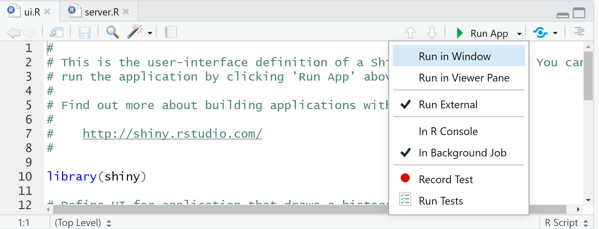

## Summary

1. Introduction
2. Structure d'une application
3. Intéractivité et communication
4. Inputs & outputs
5. Structurer sa page
6. Graphiques intéractifs
7. Isolation, Réactivité & Observe
8. HTML / CSS
9. Pour aller plus loin

## Shiny : créer des applications web avec le logiciel R

__Shiny__ est un package __R__ (et __Python__ depuis peu) qui permet la création simple d'applications web intéractives depuis le logiciel open-source __R__.

- pas de connaissances _web_ nécessaires
- le pouvoir de calcul de R et l'intéractivité du web actuel
- pour créer des applications web locales
- ou partagées avec l'utilisation de __shiny-server__, __shinyapps.io__, __shinyproxy__

<https://shiny.posit.co/>

<http://www.shinyapps.io/>

<https://www.shinyproxy.io/>

<https://www.rstudio.com/products/shiny/shiny-server/>.

----

Une application __shiny__ nécessite un ordinateur/un serveur éxécutant __R__

<div style="text-align:center" markdown="1">

</div>

## Ma première application avec shiny

- Initialiser une application est simple avec __RStudio__ :


    * File > New File > Shiny Web App > Multiple File (méthode préférentielle)
    * Basée sur deux scripts : ui.R et server.R
    * Et utilisant par défaut le sidebar layout
    * Alternative : File > New Project > New Directory > Shiny Web Application, mais un seul fichier app.R
    
- Commandes utiles :
    + lancement de l'application : bouton __Run app__
    + actualisatisation : bouton __Reload app__
    + arrêt : bouton __Stop__


----

<div style="text-align:center" markdown="1">

</div>

- __Run in Window__ : Nouvelle fenêtre, utilisant l'environnement __RStudio__
- __Run in Viewer Pane__ : Dans l'onglet _Viewer_ de __RStudio__
- __Run External__ : Dans le navigateur web par défaut
- __In R Console__ : Directement dans la console R/RStudio
- __In Background Job__ : Ou en tâche de fond

----

<div style="text-align:center" markdown="1">

</div>

```{r child = 'application.Rmd'}
```

```{r child = 'interactivity.Rmd'}
```

```{r child = 'input.Rmd'}
```

```{r child = 'output.Rmd'}
```

```{r child = 'ui_structure.Rmd'}
```

```{r child = 'htmlwidgets.Rmd'}
```

```{r child = 'conditionnal.Rmd'}
```

```{r child = 'isolation.Rmd'}
```

```{r child = 'observe_update.Rmd'}
```

```{r child = 'reactive.Rmd'}
```

```{r child = 'css.Rmd'}
```

# Pour aller plus loin : packages utiles

## Packages utiles ?

- [promises](https://rstudio.github.io/promises/articles/promises_06_shiny.html) : calculs calculs asynchrones
- [shinytest2](https://rstudio.github.io/shinytest2/) : tests automatiques d'une application
- [shinyWidgets](https://shinyapps.dreamrs.fr/shinyWidgets/) :  composants web additionnels
- [shinymanager](https://datastorm-open.github.io/shinymanager/) :  couche d'authentification
- [shinycssloaders](https://daattali.com/shiny/shinycssloaders-demo/) :  animation en attente des résultats / chargement
- [waiter](https://waiter.john-coene.com/#/) :  animation en attente des résultats  / chargement

Et encore pleins d'autres packages !

- [awesome-shiny-extensions](https://github.com/nanxstats/awesome-shiny-extensions)

# Pour aller plus loin : quelques bonnes pratiques

## Quelques bonnes pratiques

- Préférer l'underscore (_) au point (.) comme séparateur dans le nom des variables. En effet, le **.** peut amener de mauvaises intérations avec d'autres langages, comme le __JavaScript__
- Faire bien attention à __l'unicité des différents identifiants__ des inputs/outputs
- Pour éviter des problèmes éventuels avec __des versions différentes de packages__, et notamment dans le cas de __plusieurs applications shiny__ et/ou différents environnements de travail, essayer d'utiliser [renv](https://rstudio.github.io/renv/articles/renv.html)
- Mettre toute la __partie "calcul"__ dans des __fonctions/un package__ et effectuer des tests ([testthat](http://r-pkgs.had.co.nz/tests.html))

## Quelques bonnes pratiques

- Diviser la partie __ui.R__ et __server.R__ en plusieurs scripts, un par onglet par exemple :

```{r, echo = TRUE, eval = FALSE}
# ui.R
shinyUI(
  navbarPage("Divide UI & SERVER",
    source("src/ui/01_ui_plot.R", local = TRUE)$value,
    source("src/ui/02_ui_data.R", local = TRUE)$value
  )
)
# server.R
shinyServer(function(input, output, session) {
  source("src/server/01_server_plot.R", local = TRUE)
  source("src/server/02_server_data.R", local = TRUE)
})
```


## Les modules

Un module Shiny est un composant réutilisable au sein d'autres applications.

Si une fonctionnalité est amenée à être utilisée plusieurs fois dans la même application ou dans plusieurs applications, il faut alors la développer en module **shiny**. Cela se concrétise par l'écriture de 2 fonctions : 

- une pour la partie interface / UI
- une pour la partie calculs / SERVER

Plus d'infos ici :

- https://shiny.posit.co/r/articles/improve/modules/

# Pour aller plus loin : déploiement

## Déploiement

Plusieurs manières de partager son application **shiny** : 

- en la partageant *via* un package dédié, et en laissant l'utilisateur lancait l'application localement
- en la faisant tourner directement en mode *vanilla shiny* depuis un serveur, une VM ou avec *docker* ou équivalent
- avec [Shinyapps.io](http://www.shinyapps.io/), plate-forme gratuite ou payante en fonction des besoins pour déployer des applications dans le cloud
    + Pour : des offres gratuites / déploiement simple
    + Limites : certains packages non disponibles / hébergement sur le cloud
- avec [shiny-server open source](http://www.shinyapps.io/) sur ses propres serveurs
    + Pour : gratuit, configurable
    + Limites : environnement linux uniquement, Montée à l'échelle technique si beaucoup d'utilisateurs
- avec [shinyproxy](https://www.shinyproxy.io/) plate-forme java gratuite pour le déploiement d'applications *dockerisées*
- avec [Posit Connect](https://posit.co/products/enterprise/connect/) Produit commercial de RStudio / Posit
    + Pour : Produit tout inclus (RStudio, R, python, déploiement simple, ..)
    + Limites : prix
    
Plus d'infos ici : https://www.appsilon.com/post/r-shiny-deployment


```{r child = 'debug.Rmd'}
```

# Pour aller plus loin : un peu de lecture ?

## Un peu de lecture

- [Mastering Shiny by Hadley Wickham](https://mastering-shiny.org/) (https://mastering-shiny.org/)
- [Outstanding User Interfaces With Shiny by David Granjon](https://unleash-shiny.rinterface.com/) (https://unleash-shiny.rinterface.com/)
- [Engineering Production-Grade Shiny Apps by Colin Fay](https://engineering-shiny.org/) (Engineering Production-Grade Shiny Apps by Colin Fay)
